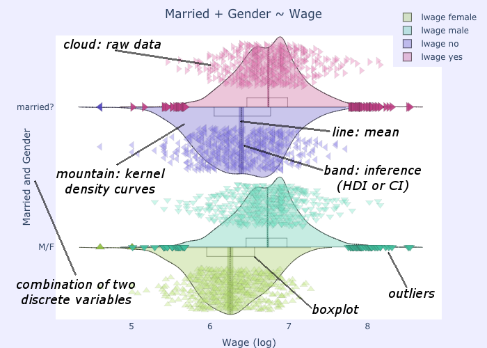

Introduction
============

A Cloudy Mountain Plot is an informative RDI [#f1]_ `categorical distribution <https://en.wikipedia.org/wiki/Categorical_distribution>`_ plot inspired by Violin, Bean and Pirate Plots.

* Like `Violin plots <https://en.wikipedia.org/wiki/Violin_plot>`_ [Hintze_Nelson_1998]_, it shows smoothed kernel density curves, revealing information which would be hidden in boxplots, for example presence of multiple "peaks" ("modes") in the distribution "mountain".

* Like `Bean plots <https://www.jstatsoft.org/article/view/v028c01>`_ [Kampstra_2008]_, it shows the raw data, drawn as a cloud of points. By default all data points are shown but you can optionally control this and limit the display to a subset of the data.

* Like `Pirate plots <https://github.com/ndphillips/yarrr>`_ [Phillips_2017]_, it marks confidence intervals (either from Student's T or as Bayesian Highest Density Intervals or as interquantile ranges) for the probable position of the true population mean.

Since by default it does not symmetrically mirror the density curves, it allows immediate comparisions of distributions side-by-side.

The present documentation introduces both what cloudy mountain plots are
and how to create them, using a plotting function (``cmplot``) which has been
coded in both Julia and Python, built on top of the freely available
:doc:`plotly` graphic library.

Elements of the plot
--------------------

(Note: check the :doc:`interactive` to see how the following figure actually looks
like when you create it, with the full interactive power of plotly)

.. glossary::

   cloud
      Marker symbols show the number and location of the raw data points.
      They are shown jittered for clarity.
      It is possible to fully control both the aspect (:option:`opacity <pointsopacity>` and :option:`shapes <pointshapes>`) of
      the markers and their :option:`number <pointsmaxdisplayed>` (in case showing them all would prove too slow or
      unelegant). It is also possible :option:`not to show <showpoints>` any point.
      For clarity, by default the points are plotted on the opposite side of the kernel density curve. They can alternatively be plotted :option:`over the density curve <pointsoverdens>`, as in the above image.

   mountain
      `Kernel density estimation <https://en.wikipedia.org/wiki/Kernel_density_estimation>`_ curve.

   line
      Indicates the mean of the distribution

   band
      Probable position of the true population mean, to desired level of confidence.
      Method used can be :option:`specified <inf>` as either CI [#f2]_ , HDI [#f3]_ or IQR [#f4]_.
      It is also possible not to show the band.
      

   boxplot
      A small `boxplot <https://en.wikipedia.org/wiki/Boxplot>`_. It can be
      :option:`shown or hidden <showboxplot>`, as desired.

   outliers
      The `outliers <https://en.wikipedia.org/wiki/Outlier>`_ are marked without
      jitter, on the baseline, and with less transparency. It is of course possible
      to choose :option:`whether to show <markoutliers>` the outliers.

.. rubric:: Footnotes 

.. [#f1] RDI: Raw data + Descriptive statistics + Inferential statistics
.. [#f2] CI: `Confidence Interval <https://en.wikipedia.org/wiki/Confidence_interval>`_, from Student's T distribution
.. [#f3] HDI: `Bayesian Highest Density Intervals <https://en.wikipedia.org/wiki/Credible_interval>`_
.. [#f4] IQR: `Interquartile range <https://en.wikipedia.org/wiki/IQR>`_
