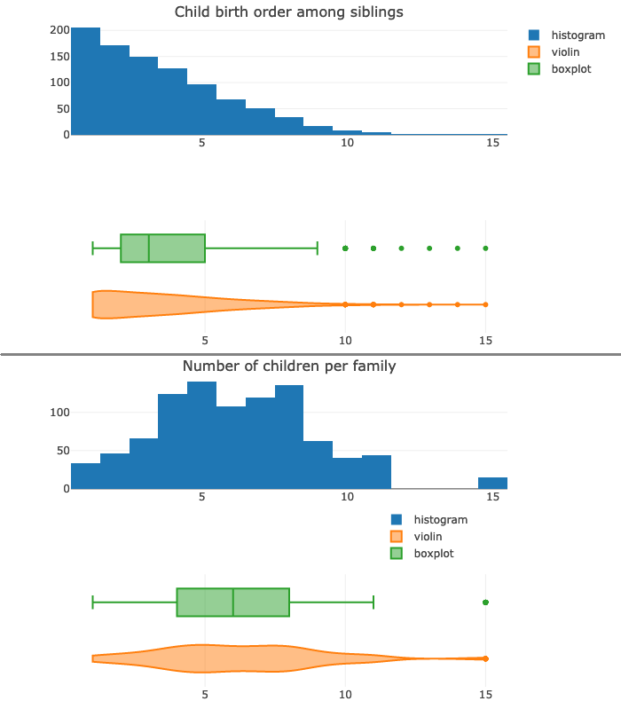

Tutorial
========

Example usages of CMPlot, with plots and options used are presented below (e.g. :ref:`heights_example`).

An introduction to the several features is also offered by the provided jupyter notebook.
This can be previewed via `nbviewer.jupyter.org <https://nbviewer.jupyter.org/github/g-insana/cmplot.py/blob/master/cmplot_python3_with_examples.ipynb>`_, or directly edited and run locally.

Hands-on
--------

In fact probably the best way to try out the several features of cmplot is to clone from github,
or to directly :download:`download the Julia <https://raw.githubusercontent.com/g-insana/CMPlot.jl/master/cmplot_julia_with_examples.ipynb>` or
the :download:`Python jupyter notebook <https://raw.githubusercontent.com/g-insana/cmplot.py/master/cmplot_python3_with_examples.ipynb>` and play with it,
tweaking options, trying different data combinations and expecially using your own data
or other publicly available datasets.

The notebook examples use the datasets from
Iris [Anderson_Edgar_Fisher_1935_1936]_ and Wages [Cornwell_Rupert_1988]_ but it
is immediate to switch to other datasets via the included calls to
`RDatasets <https://github.com/JuliaStats/RDatasets.jl>`_ - for Julia -
and `PyDatasets <https://github.com/iamaziz/PyDataset>`_ - for Python).

.. _heights_example:

Heights in families
-------------------

For this example we'll use the dataset from Galton on the heights of parents and their children [Galton_1886]_.

His data consists of the heights of 930 adult children and of their respective parentages, for a total of 205 families.

With a simple initial plot we can see that all males (sons and all fathers) occupy a very similar range of heights and all females (daughters and all mothers) likewise, and with very similar distribution:

.. code-block:: python

    >>> cmplot(df, xcol="Gender", ycol=["Father", "ChildHeight", "Mother"], pointsoverdens=True, pointshapes=["line-nw", "line-ne", "line-ew"])

* xcol: Gender
* ycol: Father, ChildHeight, Mother
* Options used: :option:`pointsoverdens <pointsoverdens>` = True, :option:`pointshapes <pointshapes>` = ["line-nw", "line-ne", "line-ew"]

Sometimes a boxplot or even a violinplot can be less informative or harder to decode than a simple histogram as shown in the top part of the next picture:

Furthermore the boxplot also suffers from a very well known drawback: it hides any multimodal distribution (the two *peaks* - modes - at 5 and 8 number of children per family; as seen in the bottom half of the picture).

Showing the raw data alongside the kernel density curve helps in seeing things more clearly:

* ycol: ChildNum, Children
* Options used: :option:`pointsoverdens <pointsoverdens>` = True, :option:`spanmode <spanmode>` = 'hard'

After `binning <https://en.wikipedia.org/wiki/Data_binning>`_ the total number of siblings in a family and the birth order (which child is born earlier or later), we can further explore the data.

For example plotting child height vs family size we can see a lower average height for children of very numerous families (with 9 or more siblings):

* xcol: ChildrenBinned
* ycol: ChildHeight
* Options used: :option:`pointsoverdens <pointsoverdens>` = True, :option:`side <side>` = 'pos', :option:`ycolorgroups <ycolorgroups>` = False

Being born late in the family was apparently even less conducive to stature: there is much lower average height for late born children compared to earlier born ones *(Note that binning on birth order in this dataset needs to be adjusted to factor for gender due to how the birth order was originally recorded)*:

* xcol: ChildNumBinned
* ycol: ChildHeight
* Options used: :option:`pointsoverdens <pointsoverdens>` = True, :option:`side <side>` = 'pos', :option:`ycolorgroups <ycolorgroups>` = False

Cloudy Mountain Plots make it is easy to separate according to combinations of two or more categorical variables. For example we can plot children's height according to both their gender and their birth order:

.. code-block:: python

    >>> cmplot(df, xcol=["ChildNumBinned", "Gender"], ycol="ChildHeight", ycolorgroups=False, xsuperimposed=True)

* xcol: ChildNumBinned, Gender
* ycol: ChildHeight
* Options used: :option:`side <side>` = 'pos', :option:`ycolorgroups <ycolorgroups>` = False, :option:`xsuperimposed <xsuperimposed>` = True,

The gender component is obviously the dominant one, but still the plot makes very obvious that children born later than their siblings are on average smaller than those born earlier.

We can also plot the height of parents and of their children according to birth order among siblings.

.. figure:: img/07-parents_children_height_birthorder.png
   :alt: Height of children and of their parents according to birth order among siblings

* xcol: ChildNumBinned
* ycol: Father, ChildHeight, Mother
* Options used: :option:`pointsoverdens <pointsoverdens>` = True, :option:`pointshapes <pointshapes>` = ["line-nw", "line-ne", "line-ew"]

Separating by gender as well as birth order shows that, for the late born, sons are on average shorter than their fathers and daughters shorter than their mothers; for early born ones the situation is reversed, with - on average - sons taller than fathers and daughters taller than mothers:

.. code-block:: python

    >>> cmplot(df, xcol=["ChildNumBinned", "Gender"], ycol=["ChildHeight", "Mother"], ycolorgroups=False, xsuperimposed=True)

* xcol: ChildNumBinned, Gender
* ycol: Father, ChildHeight, Mother
* Options used: :option:`pointsoverdens <pointsoverdens>` = True, :option:`pointshapes <pointshapes>` = ["line-nw", "line-ne", "line-ew"]

Note how the plotted clouds of raw data points caution us that there is much less data (much sparser data point clouds) for the late born, as these are the children belonging to very numerous families, which are less abundant than the smaller families.

Still the trend is there and the plot is informative and helps us to dig into the data and to make relevant information surface.
